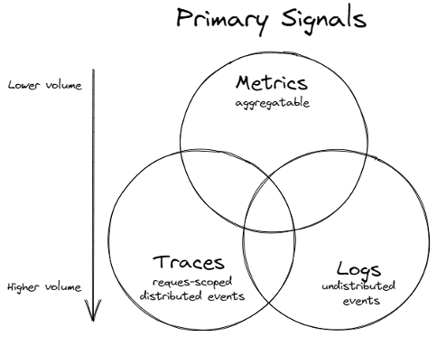

# Logs vs Metrics vs Traces

## Overview

### Metrics

The purpose of metrics is to inform observers about the health & operations regarding a component or system. A metric represents a point in time measure of a particular source, and data-wise tends to be very small. The compact size allows for efficient collection even at scale in large systems. Metrics also lend themselves very well to pre-aggregation within the component before collection, reducing computation cost for processing & storing large numbers of metric time series in a central system. Due to how efficiently metrics are processed & stored, it lends itself very well for use in automated alerting, as metrics are an excellent source for the health data for all components in the system.

### Logs

Log data inform observers about the discrete events that occurred within a component or a set of components. Just about every software component log information about its activities over time. This rich data tends to be much larger than metric data and can cause processing issues, especially if components are logging too verbosely. Therefore, using log data to understand the health of an extensive system tends to be avoided and depends on metrics for that data. Once metric telemetry highlights potential problem sources, filtered log data for those sources can be used to understand what occurred.

### Traces

Where logging provides an overview to a discrete, event-triggered log, tracing encompasses a much wider, continuous view of an application. The goal of tracing is to following a program’s flow and data progression.

In many instances, tracing represents a single user’s journey through an entire app stack. Its purpose isn’t reactive, but instead focused on optimization. By tracing through a stack, developers can identify bottlenecks and focus on improving performance.

A distributed trace is defined as a collection of spans. A span is the smallest unit in a trace and represents a piece of the workflow in a distributed landscape. It can be an HTTP request, call to a database, or execution of a message from a queue. 

When a problem does occur, tracing allows you to see how you got there:

* Which function.
* The function’s duration.
* Parameters passed.
* How deep into the function the user could get.

## Usage Guidance

When to use metric or log data to track a particular piece of telemetry can be summarized with the following points:

* Use metrics to track the occurrence of an event, counting of items, the time taken to perform an action or to report the current value of a resource (CPU, memory, etc.)
* Use logs to track detailed information about an event also monitored by a metric, particularly errors, warnings or other exceptional situations.
* A trace provides visibility into how a request is processed across multiple services in a microservices environment. Every trace needs to have a unique identifier associated with it.
